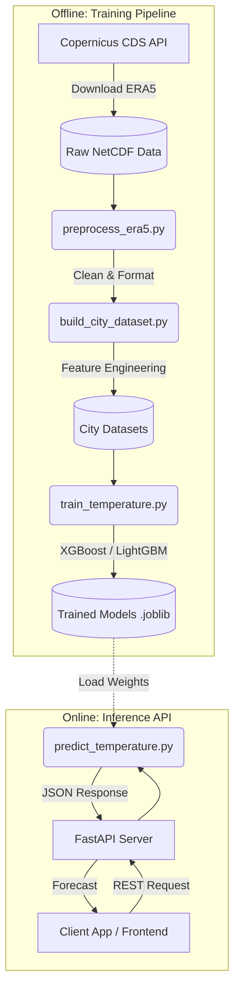

# ClimateTwin India Backend

Welcome to the **ClimateTwin India Backend** project! This repository serves as the production-ready FastAPI backend and machine learning pipeline for building a digital twin of our climate, specifically focused on localized temperature predictions.

## 🌟 What We Are Building

The AI Climate Twin is a system designed to model and predict climate patterns at a city level using historical climate data and advanced machine learning models. 

Currently, the backend accomplishes the following:
1. **Data Ingestion**: Downloads high-quality climate data (ERA5) from the Copernicus Climate Data Store (CDS).
2. **Data Processing**: Cleans and aggregates global netCDF files into localized, city-specific datasets.
3. **Machine Learning**: Trains gradient boosting models (XGBoost, LightGBM) to predict future temperatures based on historical features.
4. **API Serving**: Exposes the trained models via a blazing-fast fully asynchronous FastAPI endpoint with SQLAlchemy 2.0 and Supabase PostgreSQL integration.

---

## Features

- **FastAPI**: Fully asynchronous web framework.
- **SQLAlchemy 2.0 (Async)**: Asynchronous database connection with modern Declarative Mapped models.
- **Supabase Integration**: Direct configuration for Supabase PostgreSQL. Includes connection pool-pre-pinging to avoid dropped connections.
- **Alembic**: Asynchronous migration setup.
- **Pydantic v2**: Type safety and data validation.
- **Modular Directory Structure**: Organized by core logic, models, schemas, routers, services, and utils.

---

## 🏗️ Architecture Diagram

Below is the high-level architecture of the AI Climate Twin Backend. It is split into two main sections: the **Training Pipeline** (offline) and the **Inference API** (online).



---

## Folder Structure

```
backend/
├── app/
│   ├── main.py                 # Application entrypoint & configurations
│   ├── core/
│   │   ├── config.py           # Settings management (pydantic-settings)
│   │   └── database.py         # SQLAlchemy async engine & session setup
│   ├── models/
│   │   ├── __init__.py         # Imports models for Alembic autogeneration
│   │   └── climate_data.py     # SQLAlchemy declarative models
│   ├── schemas/
│   │   ├── __init__.py
│   │   └── climate_data.py     # Pydantic v2 validation models
│   ├── routers/
│   │   ├── __init__.py
│   │   └── climate_data.py     # API routes (GET, POST, PUT, DELETE)
│   ├── services/
│   │   ├── __init__.py
│   │   └── climate_data.py     # Business logic & database operations
│   └── utils/
│       └── __init__.py         # Utility functions & helpers
├── alembic/
│   ├── env.py                  # Alembic migration environment
│   ├── script.py.mako          # Migration template
│   └── versions/               # Directory for migration files
├── alembic.ini                 # Alembic configuration
├── requirements.txt            # Package dependencies
├── .env.example                # Sample environment variables config
└── README.md                   # Setup and execution guide
```

---

## 🔄 Pipeline Overview & Steps Involved

Our machine learning and data processing pipeline consists of several key steps, executed sequentially:


1. **Explore & Test (`explore_era5.py`, `test_era5.py`)**
   - Validates the connection to the CDS API.
   - Explores the structure of the incoming ERA5 climate data.

2. **Data Preprocessing (`preprocess_era5.py`)**
   - Loads massive `.nc` (NetCDF) files using `xarray`.
   - Handles missing values, unit conversions (e.g., Kelvin to Celsius), and spatial subsetting.

3. **Dataset Construction (`build_city_dataset.py`)**
   - Extracts time-series data for specific geographical coordinates (cities).
   - Generates tabular data suitable for machine learning models (Pandas DataFrames).

4. **Model Training (`train_temperature.py`)**
   - Splits data into training, validation, and test sets.
   - Trains state-of-the-art tree-based models (XGBoost, LightGBM).
   - Evaluates performance (RMSE, MAE) and saves the best model artifacts to disk using `joblib`.

5. **Inference & Serving (`inference/predict_temperature.py`, `main.py`)**
   - Loads the trained model into memory.
   - Takes real-time requests via FastAPI and outputs temperature predictions.

---

## 🧠 Model Training Details

The core of our predictive power relies on Gradient Boosted Trees. We use both **XGBoost** and **LightGBM** due to their excellent performance on tabular time-series data. 

**Training Process:**
- **Features:** Historical temperature, geographical coordinates (latitude/longitude), time-based features (month, day, hour).
- **Target:** Future surface temperature.
- **Evaluation:** Models are evaluated on unseen temporal splits to simulate real-world forecasting. 
- **Artifacts:** Once trained, the models and their preprocessing scalers are saved in the `models/` directory for fast loading during inference.

---

## 🚀 Getting Started

### 1. Prerequisites
- Python 3.12+
- Access to a Supabase PostgreSQL instance (or any standard Postgres DB).
- A CDS API key (configured in `~/.cdsapirc`)

### 2. Local Setup
Clone/open the repository, navigate to the directory, and perform the following steps:

1. **Create a virtual environment:**
   ```bash
   python -m venv venv
   source venv/Scripts/activate  # Windows (CMD/PowerShell)
   # OR
   source venv/bin/activate      # macOS/Linux
   ```

2. **Install dependencies:**
   ```bash
   pip install --upgrade pip
   pip install -r requirements.txt
   ```

3. **Configure Environment Variables:**
   Copy `.env.example` to `.env` and configure your database parameters:
   ```bash
   cp .env.example .env
   ```
   *Note: If using Supabase, navigate to **Project Settings -> Database** in your Supabase dashboard and copy the connection string under **Connection string -> URI** to `DATABASE_URL` in `.env`.*

---

## Database Migrations (Alembic)

All migrations run asynchronously.

### 1. Generating a migration
When you update or add any model in `app/models/`, run:
```bash
alembic revision --autogenerate -m "Add climate records table"
```

### 2. Applying migrations
To apply all pending migrations to your database:
```bash
alembic upgrade head
```

### 3. Downgrading migrations
To rollback the latest migration:
```bash
alembic downgrade -1
```

---

## Running the Server

Start the local development server with Uvicorn:
```bash
uvicorn app.main:app --reload --host 127.0.0.1 --port 8000
```

- **API Documentation**: [http://127.0.0.1:8000/docs](http://127.0.0.1:8000/docs) (Swagger UI)
- **Alternative Documentation**: [http://127.0.0.1:8000/redoc](http://127.0.0.1:8000/redoc) (ReDoc)
- **Health Check Endpoint**: [http://127.0.0.1:8000/health](http://127.0.0.1:8000/health)

---
*Note: Please ensure you keep this README updated as new scripts, models, or API endpoints are added to the repository!*
