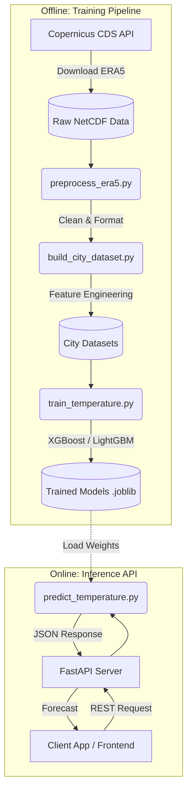

# AI Climate Twin Backend

Welcome to the **AI Climate Twin Backend** project! This repository serves as the backend infrastructure and machine learning pipeline for building a digital twin of our climate, specifically focused on localized temperature predictions.

## 🌟 What We Are Building

The AI Climate Twin is a system designed to model and predict climate patterns at a city level using historical climate data and advanced machine learning models. 

Currently, the backend accomplishes the following:
1. **Data Ingestion**: Downloads high-quality climate data (ERA5) from the Copernicus Climate Data Store (CDS).
2. **Data Processing**: Cleans and aggregates global netCDF files into localized, city-specific datasets.
3. **Machine Learning**: Trains gradient boosting models (XGBoost, LightGBM) to predict future temperatures based on historical features.
4. **API Serving**: Exposes the trained models via a blazing-fast FastAPI endpoint for seamless integration with frontend applications or other services.

---

## 🏗️ Architecture Diagram

Below is the high-level architecture of the AI Climate Twin Backend. It is split into two main sections: the **Training Pipeline** (offline) and the **Inference API** (online).



---

## 🔄 Pipeline Overview & Steps Involved

Our machine learning and data processing pipeline consists of several key steps, executed sequentially:


1. **Explore & Test (`explore_era5.py`, `test_era5.py`)**
   - Validates the connection to the CDS API.
   - Explores the structure of the incoming ERA5 climate data.

2. **Data Preprocessing (`preprocess_era5.py`)**
   - Loads massive `.nc` (NetCDF) files using `xarray`.
   - Handles missing values, unit conversions (e.g., Kelvin to Celsius), and spatial subsetting.

3. **Dataset Construction (`build_city_dataset.py`)**
   - Extracts time-series data for specific geographical coordinates (cities).
   - Generates tabular data suitable for machine learning models (Pandas DataFrames).

4. **Model Training (`train_temperature.py`)**
   - Splits data into training, validation, and test sets.
   - Trains state-of-the-art tree-based models (XGBoost, LightGBM).
   - Evaluates performance (RMSE, MAE) and saves the best model artifacts to disk using `joblib`.

5. **Inference & Serving (`inference/predict_temperature.py`, `main.py`)**
   - Loads the trained model into memory.
   - Takes real-time requests via FastAPI and outputs temperature predictions.

---

## 🧠 Model Training Details

The core of our predictive power relies on Gradient Boosted Trees. We use both **XGBoost** and **LightGBM** due to their excellent performance on tabular time-series data. 

**Training Process:**
- **Features:** Historical temperature, geographical coordinates (latitude/longitude), time-based features (month, day, hour).
- **Target:** Future surface temperature.
- **Evaluation:** Models are evaluated on unseen temporal splits to simulate real-world forecasting. 
- **Artifacts:** Once trained, the models and their preprocessing scalers are saved in the `models/` directory for fast loading during inference.

---

## 🚀 Getting Started

### Prerequisites
- Python 3.10+
- A CDS API key (configured in `~/.cdsapirc`)

### Installation

1. **Clone the repository and enter the directory:**
   ```bash
   git clone <repo-url>
   cd ai-climate-twin-be
   ```

2. **Create a virtual environment and install dependencies:**
   ```bash
   python -m venv venv
   source venv/bin/activate  # On Windows use `venv\Scripts\activate`
   pip install -r requirements.txt
   ```

3. **Run the API:**
   ```bash
   uvicorn main:app --reload
   ```
   The API will be available at `http://127.0.0.1:8000`.

---
*Note: Please ensure you keep this README updated as new scripts, models, or API endpoints are added to the repository!*