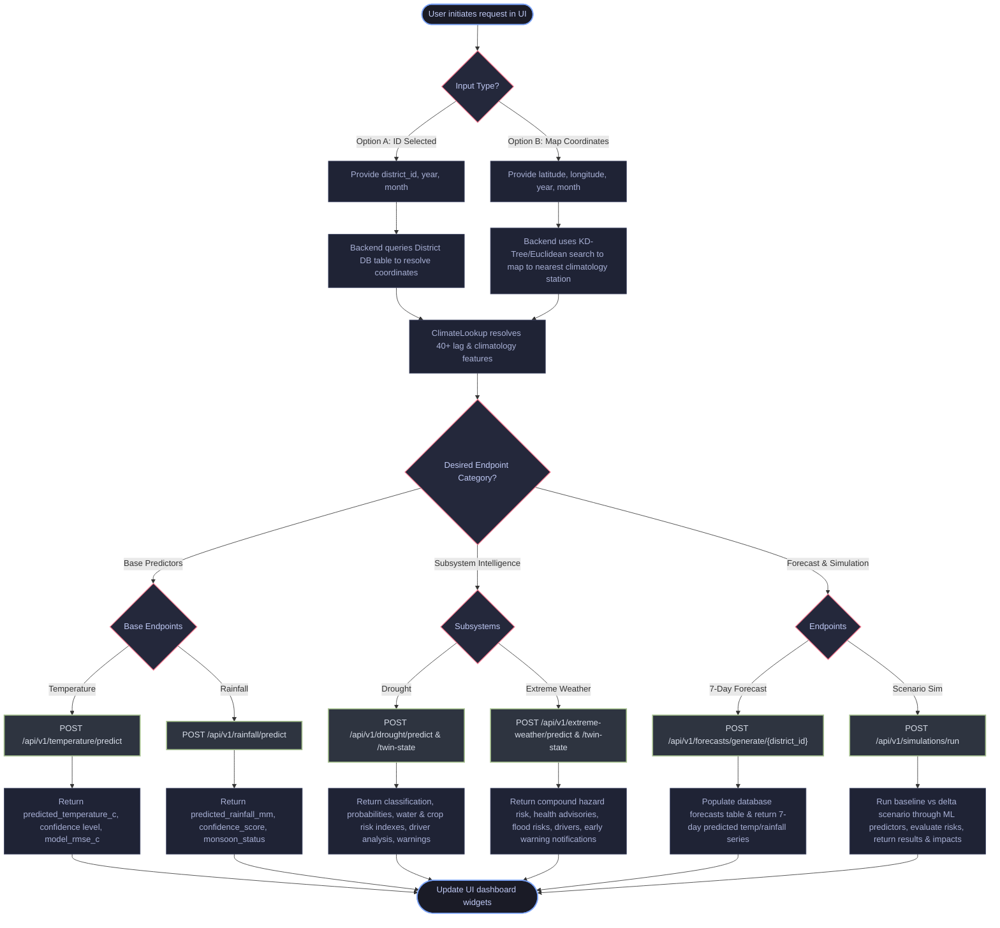

# Frontend Integration Flowchart & Guide

This guide details the integration flow for frontend developers connecting the UI to the AI Climate Digital Twin backend services.

## Overview of Client API Flow

To minimize frontend calculations and client payload sizes, the backend uses a dynamic **Climate Lookup Engine**. The frontend only needs to supply a `district_id` (or basic coordinates and calendar date). The backend then resolves historical climate baselines, lag features, and geographic zones automatically before executing predictions.

## API Endpoint Reference Table

| Category | Endpoint | Request Payload Highlight | Response Payload Highlight | Use Case |
| :--- | :--- | :--- | :--- | :--- |
| **Base Temperature** | `POST /api/v1/temperature/predict` | `{ "district_id": 1, "year": 2026, "month": 6 }` | `{ "predicted_temperature_c": 24.69, "confidence": "high" }` | Retrieve monthly mean temperature prediction. |
| **Base Rainfall** | `POST /api/v1/rainfall/predict` | `{ "district_id": 1, "year": 2026, "month": 6 }` | `{ "predicted_rainfall_mm": 7.45, "confidence_score": 0.87, "monsoon_status": "Normal Monsoon" }` | Retrieve monthly mean rainfall accumulation and monsoon performance. |
| **Drought Subsystem** | `POST /api/v1/drought/twin-state` | `{ "district_id": 1, "year": 2026, "month": 6 }` | `{ "drought_category": "Extreme", "crop_stress_index": 72.5, "reservoir_risk": "High" }` | Get full drought metrics, agricultural/water stress, and advisories. |
| **Extreme Weather** | `POST /api/v1/extreme-weather/twin-state` | `{ "district_id": 1, "year": 2026, "month": 6 }` | `{ "overall_extreme_weather_risk": "High", "heat_alert_level": "Orange" }` | Get combined heatwave/rainfall risks, public health warnings, and safety guidelines. |
| **7-Day Forecast** | `POST /api/v1/forecasts/generate/{district_id}` | *None (Params: `district_id`)* | `[ { "forecast_date": "2024-06-20", "predicted_temperature": 24.69 } ... ]` | Generates a 7-day weather series and returns the records. |
| **Delta Simulation** | `POST /api/v1/simulations/run` | `{ "district_id": 1, "temperature_change": 2.0, "rainfall_change": -10.0 }` | `{ "projections": { "temperature": 26.69 }, "impacts": { "drought_risk": "Moderate" } }` | Compare baseline vs custom scenario parameters side-by-side. |

## Key Frontend Integration Tips

1. **Lazy Loading Predictors**: Initial requests to endpoints may take 2–3 seconds as LightGBM and XGBoost models serialize into memory. Subsequent predictions are cached and return within **50-100ms**.
2. **State Rankings (Skipped)**: Note that state ranking analytics endpoints are not registered yet. To list temperatures/rainfall across districts, the frontend can query predictions for individual districts sequentially or fetch active observations using the standard GET endpoints.
3. **Coordinates Fallback**: If `district_id` is unknown, supply `latitude` and `longitude` in the input body to allow coordinate resolution.
