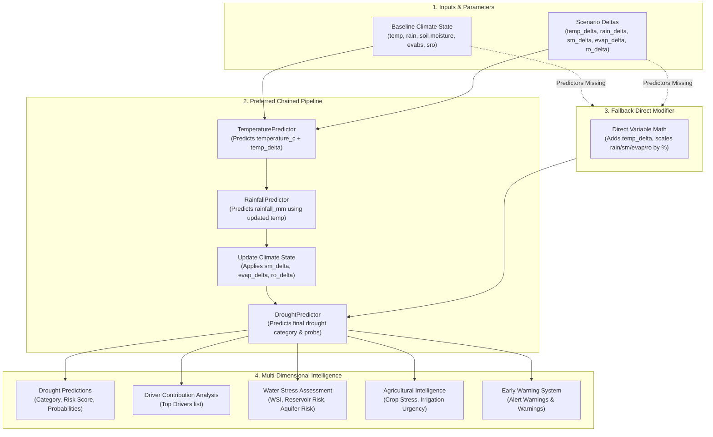

# Drought Intelligence Layer: Production Architecture and Scientific Methodology Report

This document details the production-ready **Drought Intelligence Subsystem** integrated into the Climate Digital Twin platform of India. It outlines the core architecture, data schemas, simulation methodologies, and deployment recommendations for production engineering.

---

## 1. System Architecture

The Drought Intelligence Layer is designed as a highly modular, decoupled service layer that sits on top of three serialized Machine Learning models:
- **Temperature Predictor Model** (`temperature.pkl`)
- **Rainfall Predictor Model** (`rainfall.pkl`)
- **Drought Evolution Model** (`drought.pkl`)

In a scenario-testing sandbox, the models are chained sequentially to form a cascading Climate Digital Twin.

### Chained Digital Twin Architecture Workflow



---

## 2. Input Schema

The input schema accepts a comprehensive snapshot of climate state variables, historical trends, regional climatology, and scenario deltas:

| Parameter | Type | Default | Description |
|---|---|---|---|
| **latitude** | `float` | `20.0` | Target coordinate latitude |
| **longitude** | `float` | `80.0` | Target coordinate longitude |
| **year** | `int` | `2024` | Calendar year |
| **month** | `int` | `6` | Calendar month (1–12) |
| **temperature_c** | `float` | `30.0` | Mean monthly temperature in Celsius |
| **rainfall_mm** | `float` | `10.0` | Cumulative monthly rainfall in mm |
| **soil_moisture** | `float` | `0.2` | Soil moisture index (0.0 to 1.0) |
| **evabs** | `float` | `-0.001` | Evaporation flux (negative value) |
| **sro** | `float` | `0.001` | Surface runoff depth in mm |
| **temperature_prev_1** | `float` | `29.0` | Preceding month's temperature |
| **temperature_prev_3** | `float` | `28.0` | Month t-3 temperature |
| **rainfall_prev_1** | `float` | `5.0` | Preceding month's rainfall |
| **rainfall_prev_3** | `float` | `2.0` | Month t-3 rainfall |
| **soil_moisture_prev_1** | `float` | `0.18` | Preceding month's soil moisture |
| **rolling_temp_3m** | `float` | `28.5` | 3-month rolling mean temperature |
| **rolling_temp_6m** | `float` | `25.0` | 6-month rolling mean temperature |
| **rolling_rainfall_3m** | `float` | `15.0` | 3-month rolling mean rainfall |
| **rolling_rainfall_6m** | `float` | `30.0` | 6-month rolling mean rainfall |
| **rolling_sm_3m** | `float` | `0.22` | 3-month rolling mean soil moisture |
| **rolling_sm_6m** | `float` | `0.25` | 6-month rolling mean soil moisture |
| **dry_month_streak** | `float` | `0.0` | Consecutive dry months streak |
| **low_sm_streak** | `float` | `0.0` | Consecutive low soil moisture streak |
| **rainfall_climatology** | `float` | `12.0` | Historical mean rainfall for the month |
| **rainfall_climatology_std** | `float` | `5.0` | Standard deviation of rainfall climatology |
| **sm_climatology** | `float` | `0.25` | Historical mean soil moisture for the month |
| **sm_climatology_std** | `float` | `0.05` | Standard deviation of soil moisture climatology |
| **temperature_climatology** | `float` | `28.0` | Historical mean temperature for the month |
| **temperature_climatology_std** | `float` | `2.0` | Standard deviation of temperature climatology |
| **temperature_delta** | `float` | `0.0` | Temperature modifier delta (°C) |
| **rainfall_delta** | `float` | `0.0` | Rainfall percentage modifier delta (%) |
| **soil_moisture_delta** | `float` | `0.0` | Soil moisture percentage modifier delta (%) |
| **evaporation_delta** | `float` | `0.0` | Evaporation percentage modifier delta (%) |
| **runoff_delta** | `float` | `0.0` | Runoff percentage modifier delta (%) |
| **climate_zone** | `str` | `"Indo-Gangetic Plains"` | Climate zone OHE category |

---

## 3. Output Schema

The unified Digital Twin response contains six main intelligence blocks:

```json
{
  "drought_prediction": {
    "drought_category": "Low | Medium | High | Extreme",
    "severity_score": 0.542,
    "drought_risk_score": 0.542,
    "confidence_score": 0.812,
    "confidence_level": "High | Medium | Low",
    "probabilities": {
      "Low": 0.05,
      "Medium": 0.138,
      "High": 0.612,
      "Extreme": 0.20
    }
  },
  "scenario_analysis": {
    "baseline_category": "Medium",
    "baseline_score": 0.450,
    "scenario_category": "High",
    "scenario_score": 0.812,
    "risk_change": "+1 level"
  },
  "drivers": {
    "top_drivers": ["Rainfall Deficit", "Low Soil Moisture"]
  },
  "water_intelligence": {
    "water_stress_index": 68.2,
    "reservoir_risk": "High",
    "groundwater_risk": "Medium",
    "water_availability_status": "Stressed"
  },
  "agriculture_intelligence": {
    "crop_stress_index": 71.4,
    "irrigation_need": "High",
    "agricultural_risk": "High"
  },
  "early_warning": {
    "warning": true,
    "warning_level": "High",
    "message": "Elevated High Drought probability: 61.2%."
  }
}
```

---

## 4. Scenario Simulation Methodology (Digital Twin Chaining)

When a scenario simulation request is made with active delta modifiers:
1. **Baseline State Calculation**: All deltas (`temperature_delta`, `rainfall_delta`, `soil_moisture_delta`, `evaporation_delta`, `runoff_delta`) are forced to `0.0` to run the baseline model.
2. **Preferred Chained Pipeline Execution**:
   - `TemperaturePredictor` runs using `temperature_delta` to output the simulated `temperature_c`.
   - `RainfallPredictor` runs using the simulated `temperature_c` and `rainfall_delta` to output the simulated `rainfall_mm`.
   - Remaining parameters are scaled by their percentage modifiers:
     - `soil_moisture_simulated = soil_moisture * (1 + soil_moisture_delta / 100)`
     - `evabs_simulated = evabs * (1 + evaporation_delta / 100)`
     - `sro_simulated = sro * (1 + runoff_delta / 100)`
   - The updated variables are fed to the `DroughtPredictor` to predict the scenario output.
3. **Fallback Execution**: If predictors are missing, direct mathematical modifiers are applied to variables directly before prediction.
4. **Risk Change Calculation**: Baseline vs scenario categories are mapped to indexes (Low=0, Medium=1, High=2, Extreme=3). The category delta is displayed as a relative levels change (e.g. `+2 levels`, `No change`, `-1 level`).

---

## 5. Water Stress Assessment Methodology

- **`water_stress_index` (WSI)**: A composite physical-probabilistic index scaling from 0 to 100:
  $$WSI = 100 \times \left( 0.3 \times (1 - \text{SM\_norm}) + 0.3 \times (1 - \text{Rain\_norm}) + 0.1 \times (1 - \text{Runoff\_norm}) + 0.3 \times \text{Drought\_probability} \right)$$
  - $\text{SM\_norm} = \text{soil\_moisture} / 0.4$ (capped at 1.0)
  - $\text{Rain\_norm} = \text{rainfall\_mm} / \text{rainfall\_climatology}$
  - $\text{Runoff\_norm} = \text{sro} / 0.05$ (capped at 1.0)
- **`reservoir_risk`**:
  - `Critical`: Rainfall < 10.0mm, runoff (`sro`) < 0.002, and drought risk score > 0.6.
  - `High`: Rainfall < 25.0mm, or runoff < 0.005, or drought risk score > 0.4.
  - `Medium`: Drought risk score > 0.15.
  - `Low`: Otherwise.
- **`groundwater_risk`**: Evaluates soil moisture depletion streak and long term anomalies:
  - `Critical`: Soil moisture streak $\ge$ 4 months, cumulative SM deficit $\ge$ 40%, or $Z_{\text{SM}} < -2.0$.
  - `High`: Soil moisture streak $\ge$ 2 months, cumulative SM deficit $\ge$ 20%, or $Z_{\text{SM}} < -1.2$.
  - `Medium`: $Z_{\text{SM}} < -0.5$ or cumulative SM deficit $\ge$ 5%.
  - `Low`: Otherwise.
- **`water_availability_status`**:
  - `Deficit` (WSI > 75), `Stressed` (50 < WSI $\le$ 75), `Sufficient` (20 < WSI $\le$ 50), `Abundant` (WSI $\le$ 20).

---

## 6. Agricultural Intelligence Methodology

- **`crop_stress_index` (CSI)**: Scales from 0 to 100 based on agronomic thresholds:
  $$CSI = 100 \times \left( 0.45 \times \text{SM\_stress\_factor} + 0.25 \times \text{Heat\_stress\_factor} + 0.30 \times \text{Drought\_probability} \right)$$
  - $\text{SM\_stress\_factor} = \max\left(0, \min\left(1, \frac{0.30 - \text{soil\_moisture}}{0.20}\right)\right)$
  - $\text{Heat\_stress\_factor} = \max\left(0, \min\left(1, \frac{\text{temperature\_c} - 28.0}{12.0}\right)\right)$
- **`irrigation_need`**:
  - `Critical`: Soil moisture < 0.10 and Temperature > 35°C.
  - `High`: Soil moisture < 0.15 or CSI > 65.0.
  - `Medium`: Soil moisture < 0.22 or CSI > 35.0.
  - `Low`: Otherwise.
- **`agricultural_risk`**:
  - `Critical`: CSI > 75.0 or drought category is `Extreme`.
  - `High`: CSI > 50.0 or drought category is `High`.
  - `Medium`: CSI > 25.0 or drought category is `Medium`.
  - `Low`: Otherwise.

---

## 7. Early Warning Methodology

- **Triggers**:
  - Probability of Extreme drought exceeds `0.15`.
  - Probability of High drought exceeds `0.35`.
  - Rapid escalation: Worsening drought momentum (`drought_momentum < -5.0`) or increasing monthly deficit (`drought_trend < -5.0`).
- **Warning Levels**:
  - `Critical`: Extreme Probability > 30% OR High+Extreme Probability > 70%.
  - `High`: Extreme Probability > 15% OR High Probability > 40%.
  - `Medium`: Medium Probability > 50% OR High Probability > 25%.
  - `Low`: Otherwise.
- **Message**: Actionable notifications generated dynamically based on active triggers.

---

## 8. Confidence Estimation Methodology

For all model inferences, the confidence score and level are derived from LightGBM class probabilities:
- **`confidence_score`**: $\max(\{P(\text{Low}), P(\text{Medium}), P(\text{High}), P(\text{Extreme})\})$
- **`confidence_level`**:
  - `High` if $\text{confidence\_score} \ge 0.85$
  - `Medium` if $0.65 \le \text{confidence\_score} < 0.85$
  - `Low` if $\text{confidence\_score} < 0.65$

---

## 9. Example Request and Response

### Example POST `/api/v1/drought/twin-state`

#### Request Payload
```json
{
  "latitude": 28.61,
  "longitude": 77.20,
  "year": 2030,
  "month": 5,
  "temperature_c": 42.5,
  "rainfall_mm": 2.0,
  "soil_moisture": 0.08,
  "evabs": -0.005,
  "sro": 0.000,
  "temperature_delta": 2.0,
  "rainfall_delta": -20.0,
  "soil_moisture_delta": -15.0,
  "evaporation_delta": 10.0,
  "runoff_delta": -5.0,
  "climate_zone": "Indo-Gangetic Plains"
}
```

#### Response Payload
```json
{
  "drought_prediction": {
    "drought_category": "Low",
    "severity_score": 0.015,
    "drought_risk_score": 0.015,
    "confidence_score": 0.81,
    "confidence_level": "Medium",
    "probabilities": {
      "Low": 0.81,
      "Medium": 0.175,
      "High": 0.008,
      "Extreme": 0.007
    }
  },
  "scenario_analysis": {
    "baseline_category": "Low",
    "baseline_score": 0.017,
    "scenario_category": "Low",
    "scenario_score": 0.006,
    "risk_change": "No change"
  },
  "drivers": {
    "top_drivers": [
      "High Temperature Anomaly",
      "Low Soil Moisture",
      "Rainfall Deficit"
    ]
  },
  "water_intelligence": {
    "water_stress_index": 63.0,
    "reservoir_risk": "High",
    "groundwater_risk": "Critical",
    "water_availability_status": "Stressed"
  },
  "agriculture_intelligence": {
    "crop_stress_index": 70.4,
    "irrigation_need": "Critical",
    "agricultural_risk": "High"
  },
  "early_warning": {
    "warning": false,
    "warning_level": "Low",
    "message": "Drought severity is rapidly increasing due to accumulating water deficits."
  }
}
```

---

## 10. Deployment Recommendations

1. **Singleton Pattern for ML Services**: Instantiate the `DroughtPredictor` service once at FastAPI application startup to avoid loading 17MB model files on every request.
2. **Batch Prediction Optimization**: Expose `/predict/batch` endpoint to run large-scale spatial simulations efficiently, taking advantage of vectorization in `pandas` and `lightgbm` prediction loops.
3. **Data Caching**: Regional climatologies and historical averages should be cached by latitude/longitude/month in memory (e.g. Redis) so that client integrations do not need to query database observations repeatedly.
4. **Monitoring and Logging**: Track distribution drift of predictions over time. Low confidence levels (probability < 0.65) should trigger logging alerts for data quality auditing.
