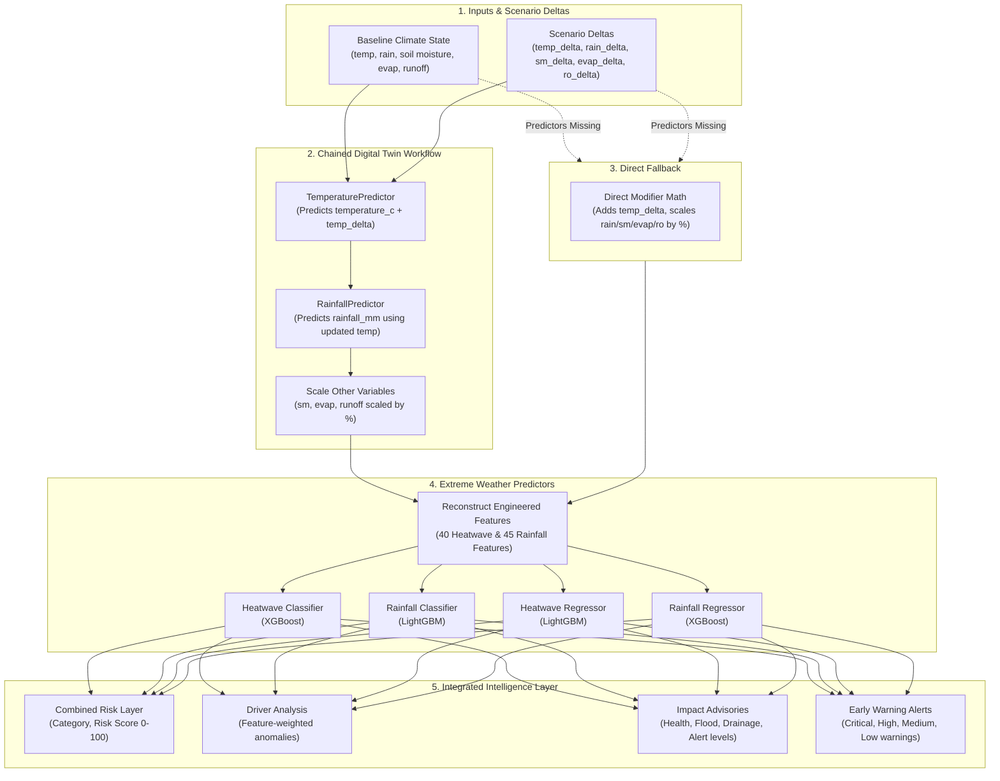

# Extreme Weather Intelligence Subsystem: Production Architecture & Methodology Report
## AI Climate Digital Twin of India

This report details the production-ready **Extreme Weather Intelligence Subsystem** integrated into the Climate Digital Twin platform of India. It covers the system architecture, inference service logic, combined risk aggregation, scenario simulation workflows, early warning priorities, public-health/hydrological impacts, and FastAPI endpoints.

---

## 1. System Architecture

The Extreme Weather Intelligence Layer is built as a modular service sitting on top of four serialized Machine Learning models:
- **Heatwave Classifier** (`heatwave.pkl` - XGBoost)
- **Extreme Rainfall Classifier** (`extreme_rainfall.pkl` - LightGBM)
- **Heatwave Severity Regressor** (`heatwave_severity.pkl` - LightGBM)
- **Extreme Rainfall Severity Regressor** (`extreme_rainfall_severity.pkl` - XGBoost)

In addition, it chains with the existing serialized models (**TemperaturePredictor** and **RainfallPredictor**) to form a cascading Climate Digital Twin.

### Chained Simulation Pipeline Flow


---

## 2. Input & Output Schemas

### Inference Input Parameter Requirements
The API accepts a comprehensive snapshot of climate variables, coordinates, historical baselines, and scenario deltas:

| Parameter | Type | Default | Description |
|---|---|---|---|
| **latitude** | `float` | `20.0` | coordinate latitude |
| **longitude** | `float` | `80.0` | coordinate longitude |
| **year** | `int` | `2024` | Target year |
| **month** | `int` | `6` | Target month (1-12) |
| **temperature_c** | `float` | `30.0` | Baseline monthly temperature in Celsius |
| **rainfall_mm** | `float` | `10.0` | Baseline monthly rainfall in mm |
| **soil_moisture** | `float` | `0.2` | Baseline soil moisture index (0.0 to 1.0) |
| **evabs** | `float` | `-0.001` | Evaporation flux (negative value) |
| **sro** | `float` | `0.001` | Surface runoff in mm |
| **temperature_prev_1** | `float` | `29.0` | Preceding month's temperature |
| **temperature_prev_3** | `float` | `28.0` | Month t-3 temperature |
| **rainfall_prev_1** | `float` | `5.0` | Preceding month's rainfall |
| **rainfall_prev_3** | `float` | `2.0` | Month t-3 rainfall |
| **soil_moisture_prev_1** | `float` | `0.18` | Preceding month's soil moisture |
| **rolling_temp_3m** | `float` | `28.5` | 3-month rolling mean temperature |
| **rolling_rainfall_3m** | `float` | `15.0` | 3-month rolling mean rainfall |
| **rolling_temp_6m** | `float` | `25.0` | 6-month rolling mean temperature |
| **rolling_rainfall_6m** | `float` | `30.0` | 6-month rolling mean rainfall |
| **temp_climo_mean** | `float` | `28.0` | historical mean temperature |
| **temp_climo_std** | `float` | `2.0` | historical std temperature |
| **rain_climo_mean** | `float` | `12.0` | historical mean rainfall |
| **rain_climo_std** | `float` | `5.0` | historical std rainfall |
| **sm_climo_mean** | `float` | `0.25` | historical mean soil moisture |
| **sm_climo_std** | `float` | `0.05` | historical std soil moisture |
| **zone_temp_mean** | `float` | `28.0` | Climate zone average temperature |
| **zone_temp_std** | `float` | `2.0` | Climate zone std temperature |
| **zone_rain_mean** | `float` | `12.0` | Climate zone average rainfall |
| **zone_rain_std** | `float` | `5.0` | Climate zone std rainfall |
| **seasonal_temp_mean** | `float` | `28.0` | Seasonal (India-wide) average temperature |
| **seasonal_rain_mean** | `float` | `12.0` | Seasonal (India-wide) average rainfall |
| **consecutive_hot_months** | `float` | `0.0` | Preceding hot months streak |
| **consecutive_wet_months** | `float` | `0.0` | Preceding wet months streak |
| **temperature_delta** | `float` | `0.0` | Temperature delta modifier (°C) |
| **rainfall_delta** | `float` | `0.0` | Rainfall percentage modifier (%) |
| **soil_moisture_delta** | `float` | `0.0` | Soil moisture percentage modifier (%) |
| **evaporation_delta** | `float` | `0.0` | Evaporation percentage modifier (%) |
| **runoff_delta** | `float` | `0.0` | Runoff percentage modifier (%) |
| **climate_zone** | `str` | `"Indo-Gangetic Plains"` | Climate zone name |

---

## 3. Scientific Methodologies

### 1. Combined Extreme Weather Risk Layer
The overall risk score merges Heatwave and Extreme Rainfall severities using a Max-dominant formulation with a compound event penalty:

$$OverallRiskScore = \max(Score_{HW}, Score_{ER}) \times 0.8 + \text{mean}(Score_{HW}, Score_{ER}) \times 0.2$$

*   **Compound Event Penalty**: If both the Heatwave severe probability ($P(\text{High}) + P(\text{Extreme})$) and Extreme Rainfall severe probability cross $35\%$, a compound hazard penalty of $+10.0$ is added.
*   **Qualitative Classes**:
    *   `Low`: $Score < 35$
    *   `Medium`: $35 \le Score < 60$
    *   `High`: $60 \le Score < 80$
    *   `Extreme`: $Score \ge 80$

### 2. Scenario Simulation & Chaining
When a scenario simulation request is received:
1.  **Baseline State**: Deltas are forced to `0.0`. Predictions calculate standard base categories and risk scores.
2.  **Simulation Workflow**: If predictors are available, temperature and rainfall are forecasted in sequence. Scaled soil moisture ($1 + \Delta_{SM}/100$), evaporation ($1 + \Delta_{EVAP}/100$), and runoff ($1 + \Delta_{RO}/100$) are combined. If predictors are absent, variables are modified directly using mathematical scaling deltas.
3.  **Risk Change**: Outputs the relative category levels difference (e.g. `+2 levels`, `No change`, `-1 level`).

### 3. Public Health & Hydrological Impact Advisories
*   **Heatwave Impact**: 
    *   `health_risk` is determined from severity and temperature anomaly.
    *   `outdoor_exposure_risk` assesses safety limits for outdoor laborers and activities.
    *   `heat_alert_level` maps to Color Codes: **Green** (Low), **Yellow** (Medium), **Orange** (High), and **Red** (Extreme).
    *   Generates clear recommendations (e.g. "Stay hydrated, avoid direct sun between 11:00 AM and 4:00 PM").
*   **Rainfall Impact**:
    *   `flash_flood_risk` combines rainfall severity, soil saturation, and runoff pressure.
    *   `surface_runoff_risk` tracks water flow hazards.
    *   `drainage_overload_risk` monitors storm drainage capacities.
    *   Generates actionable flood recommendations.

### 4. Driver Analysis
Combines local feature anomalies with model Gini feature importance weights.
*   **Heatwave Drivers**: Evaluates `hw_temperature_anomaly`, `hw_heat_stress`, soil moisture deficit (`sm_climo_mean - soil_moisture`), and rainfall deficit (`rain_climo_mean - rainfall_mm`).
*   **Rainfall Drivers**: Evaluates `er_rainfall_anomaly`, `er_runoff_pressure`, `er_soil_saturation`, and `er_rainfall_intensity`.
*   Ranks contribution scores to find the top three active drivers.

### 5. Early Warning Alerts
Fires warning tiers based on the class probabilities:
*   **Tiers**: `Low`, `Medium`, `High`, `Critical`.
*   **Combined Warning**: Triggers when either Heatwave or Rainfall warning level is $\ge$ `Medium`. The message is dynamically constructed to describe compound hazards or individual peaks.

---

## 4. FastAPI Endpoints & Payload Examples

### 1. Single State Prediction: `POST /api/v1/extreme-weather/predict`
#### Request Payload
```json
{
  "latitude": 28.61,
  "longitude": 77.20,
  "year": 2024,
  "month": 7,
  "temperature_c": 41.5,
  "rainfall_mm": 240.0,
  "soil_moisture": 0.40,
  "evabs": -0.005,
  "sro": 0.040,
  "temperature_prev_1": 40.0,
  "temperature_prev_3": 38.0,
  "rainfall_prev_1": 150.0,
  "rainfall_prev_3": 100.0,
  "soil_moisture_prev_1": 0.38,
  "rolling_temp_3m": 39.5,
  "rolling_rainfall_3m": 120.0,
  "rolling_temp_6m": 35.0,
  "rolling_rainfall_6m": 90.0,
  "temp_climo_mean": 38.0,
  "temp_climo_std": 2.0,
  "rain_climo_mean": 180.0,
  "rain_climo_std": 30.0,
  "sm_climo_mean": 0.35,
  "sm_climo_std": 0.05,
  "zone_temp_mean": 38.0,
  "zone_temp_std": 2.0,
  "zone_rain_mean": 180.0,
  "zone_rain_std": 30.0,
  "seasonal_temp_mean": 38.0,
  "seasonal_rain_mean": 180.0,
  "consecutive_hot_months": 2.0,
  "consecutive_wet_months": 3.0,
  "climate_zone": "Indo-Gangetic Plains"
}
```

#### Response Payload
```json
{
  "heatwave": {
    "category": "Extreme",
    "severity": 27.3,
    "confidence": 0.822
  },
  "extreme_rainfall": {
    "category": "Extreme",
    "severity": 62.5,
    "confidence": 1.0
  }
}
```

### 2. Scenario Simulation: `POST /api/v1/extreme-weather/simulate`
#### Request Payload (with deltas)
```json
{
  "latitude": 28.61,
  "longitude": 77.20,
  "year": 2024,
  "month": 7,
  "temperature_c": 41.5,
  "rainfall_mm": 240.0,
  "soil_moisture": 0.40,
  "evabs": -0.005,
  "sro": 0.040,
  "temp_climo_mean": 38.0,
  "temp_climo_std": 2.0,
  "rain_climo_mean": 180.0,
  "rain_climo_std": 30.0,
  "sm_climo_mean": 0.35,
  "sm_climo_std": 0.05,
  "zone_temp_mean": 38.0,
  "zone_temp_std": 2.0,
  "zone_rain_mean": 180.0,
  "zone_rain_std": 30.0,
  "seasonal_temp_mean": 38.0,
  "seasonal_rain_mean": 180.0,
  "temperature_delta": 2.0,
  "rainfall_delta": 20.0,
  "soil_moisture_delta": 10.0,
  "evaporation_delta": 5.0,
  "runoff_delta": 15.0,
  "climate_zone": "Indo-Gangetic Plains"
}
```

#### Response Payload
```json
{
  "baseline_risk": "High",
  "baseline_score": 64.6,
  "scenario_risk": "Low",
  "scenario_score": 18.1,
  "risk_change": "-2 levels"
}
```

### 3. Unified Twin State: `POST /api/v1/extreme-weather/twin-state`
#### Response Payload
```json
{
  "heatwave_prediction": {
    "category": "Extreme",
    "severity": 27.3,
    "confidence": 0.822
  },
  "rainfall_extreme_prediction": {
    "category": "Extreme",
    "severity": 62.5,
    "confidence": 1.0
  },
  "overall_extreme_weather": {
    "overall_extreme_weather_risk": "High",
    "overall_risk_score": 69.0
  },
  "scenario_analysis": {
    "baseline_risk": "High",
    "baseline_score": 64.6,
    "scenario_risk": "Low",
    "scenario_score": 18.1,
    "risk_change": "-2 levels"
  },
  "driver_analysis": {
    "top_drivers": [
      "Intense Daily Precipitation",
      "Rainfall Anomaly Surge",
      "High Soil Saturation"
    ]
  },
  "impact_assessment": {
    "heatwave_impact": {
      "health_risk": "Extreme",
      "outdoor_exposure_risk": "High",
      "heat_alert_level": "Red",
      "recommendations": [
        "RED ALERT: Extreme hazard. Avoid all outdoor exposures. Keep room ventilation active.",
        "Monitor high-risk individuals (elderly, children) for signs of heatstroke."
      ]
    },
    "rainfall_impact": {
      "flash_flood_risk": "High",
      "surface_runoff_risk": "High",
      "drainage_overload_risk": "High",
      "recommendations": [
        "CRITICAL: Extreme flood alert. Evacuate low-lying zones immediately.",
        "Do NOT attempt to cross flooded roadways or waterlogged bridges."
      ]
    }
  },
  "early_warning": {
    "warning": true,
    "warning_level": "Critical",
    "event_type": "Compound Heat-Rainfall",
    "message": "Compound Heat & Flood hazard warning active. High stress levels detected."
  }
}
```

---

## 5. Deployment Notes

1.  **Model Cache Initialization**: Load the `ExtremeWeatherPredictor` as a singleton class on FastAPI startup (integrated in `app/routers/extreme_weather.py`) to prevent loading and unloading joblib weights on every request.
2.  **Stateless Feature Engineering**: Anomaly equations and Steadman heat index indices are calculated on the fly, avoiding database state calls during inference.
3.  **Digital Twin Cascading Fallback**: Ensure the Temperature and Rainfall predictor models are located in the models directory so that the chained pipeline can dynamically update inputs, falling back to direct delta scaling math if the underlying predictors are unavailable.